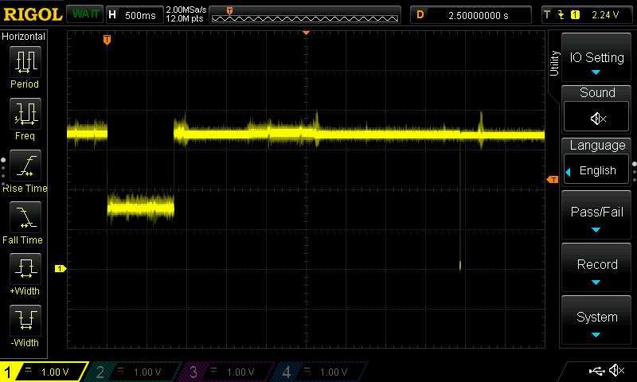

# Rev B
(not yet defined)

## Findings

# Rev A

## Findings

* Not all microUSB connectors fit into the Pico USB socket due to a missing cutout in the PCB.
 
__Workaround:__ Try to find a suitable USB cable or cut the area in the PCB around the USB socket.

* The VSYS of the Pico is connected to the battery which is necessary when the device is supplied from a 3V battery. With the USB cable attached to the Pico for programming and debugging purposes VSYS is approx. 5V (-0.4V due to serial Schottky diode) which can destroy the power controller STM32U031.
 
__Workaround:__ This connection needs to be cut on the board for programming and test purposes and later connected when the device is powered by its batteries.

### SHUTDN_REQ_IN Voltage Levels

A signal on this line is sent from the Pi Pico to the power controller to indicate a request to power down the Pi Pico. The signal is active low, e.g. a falling edge indicates the request.

The GPIO PA8 of the power controller is configured as input with internal pullup resistor. The output GPIO8 of the Pi Pico is configured as open drain output after initialization.

Unfortunately after powerup of the Pi Pico it takes some time until the initiation routine written in Python takes place and configures the port pin as open drain output. Depending on the size of the application (load time) this currently takes about 800ms. During this time the Pi Pico pins are configured as input with pull-down resistors. Both chips has pullup/pulldown resistors with approx. 50kOhms which effectivly results in a voltage about 1.5V. This is an undefined level and may lead to unexpected switching of the input in the power controller. 

At the trigger point the Pi Pico gets powered and activates the pulldown resistors as described. 800ms later the Python initialization routine configures the pin as expected and the voltage level jumps to about 3.3V. 

__Workaround:__ Inhibit (ignore) the signal on this pin for a period of time after powering up the Pi Pico. In the current implementation a time constant of 2s is used.

